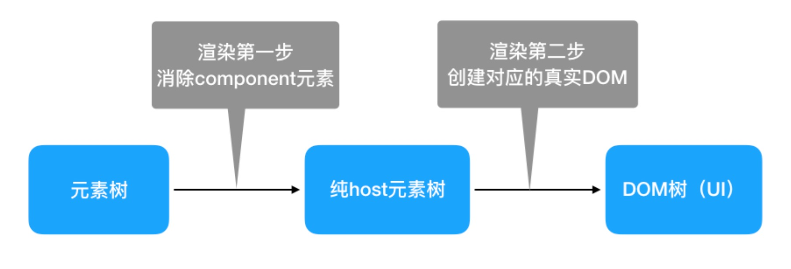
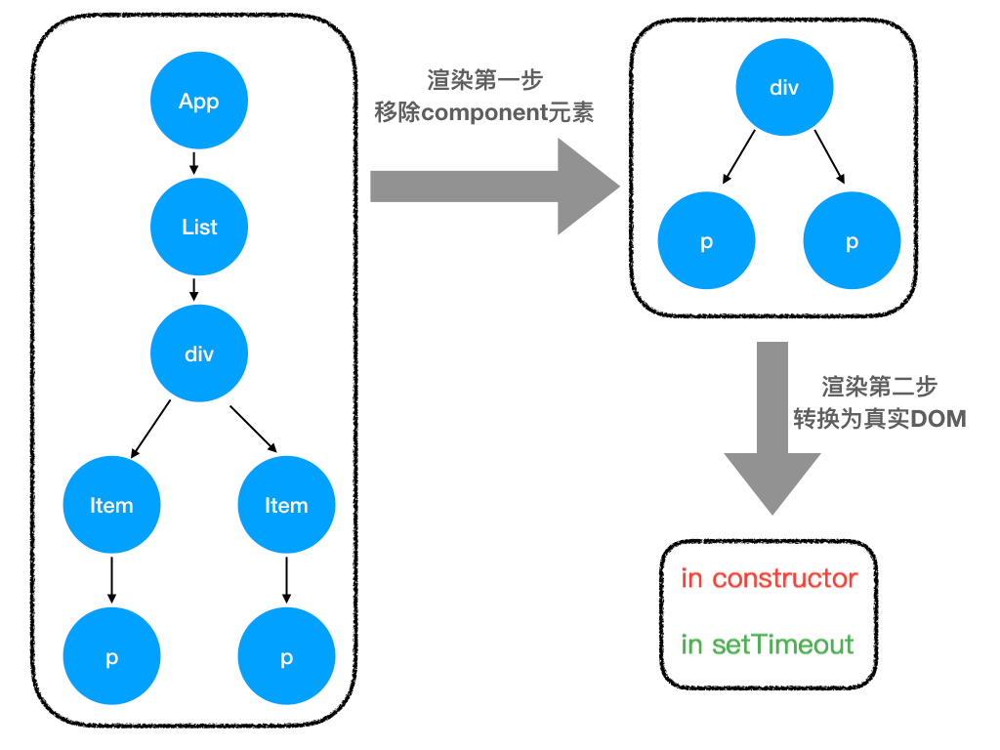
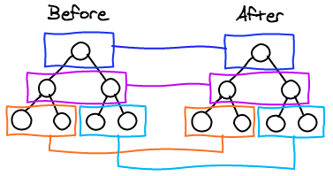
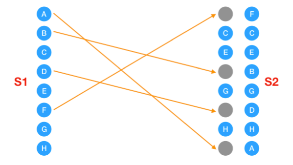

# 玩转React系列1：React工作原理

<!-- 
分享感受：2019年3月27日进行了React v15框架原理的分享。这次分享从19:10讲到了21:10多，共2个多小时。非常开心能有机会分享给这么多人听，而且一次分享了这么长时间。 
-->

## 目录

- 0\. 演示demo
- 1\. React Element及其渲染过程
  - 1.1. 首次渲染过程
  - 1.2. 更新渲染过程
  - 1.3. 如果高效地更新渲染
- 2\. 从源码看渲染过程
  - 2.1. 代码调用图
  - 2.2. 首次渲染过程
  - 2.3. 更新渲染过程
  - 2.4. React列表更新策略的问题
- A\. 参考

笔者在工作中持续使用了一年多的React，慢慢感觉React使用起来很简单，但是要掌握各种局限条件下的最佳实战却很难。比如怎么去封装好一个通用组件？哪些东西该暴露？哪些东西又不该暴露呢？为啥React这么强大却用起来很简单？这些问题，驱使我去探索React及其配套，我想看看React的设计原理，想看看一些优秀的第三方库的设计好坏。为此，我计划边探索边把自己的所得输出出来，形成一系列文章。相信输出过程可以让自己更加深入地理解React，也希望能给读者带来一些新的理解。本文是玩转系列的第一篇，全景式的讲解React的工作原理。

本文包括两部分内容。首先整体介绍React中的核心概念**元素**（element，也叫虚拟DOM）及React对它的渲染过程。然后从源代码角度展示这一过程。本文阅读的是React v15版本的最新源码([GitHub地址](https://github.com/facebook/react/tree/15-stable))，包括react模块和浏览器环境下的renderer（react-dom模块中的一部分，不包括server render）。

## 0. 演示demo

为了讲解方便，引入一个基本的demo。另外为了简化起见，也没有使用jsx语法糖，对应的jsx可以在注释中看到。这个demo的功能是展示一个消息列表，涉及React初次渲染、更新渲染（包括列表）的功能，基本上涵盖了React的各个方面。[在线演示地址](https://codepen.io/lhtin/pen/JqvXQr)

demo主要的代码如下：

```jsx
class Item extends React.Component {
  render () {
    return (
      /* <p style={{color: this.props.color}}>{this.props.children}</p> */
      React.createElement(
        'p',
        {style: {color: this.props.color}},
        this.props.children
      )
    )
  }
}
const List = (props) => {
  return (
    /* <div> ... </div> */
    React.createElement(
      'div',
      null,
      props.list.map((item) => (
        /* <Item key={item.key} color={item.color}>{item.content}</Item> */
        React.createElement(
          Item,
          {
            key: item.key,
            color: item.color
          },
          item.content
        )
      ))
    )
  )
}
class App extends React.Component {
  constructor (props) {
    super(props)
    this.state = {
      msgList: [{
        key: 1,
        color: '#f44336', // red
        content: 'in constructor'
      }]
    }
  }
  componentDidMount () {
    setTimeout(() => {
      this.setState({
        msgList: [
          ...this.state.msgList,
          {
            key: 2,
            color: '#4caf50', // green
            content: 'in setTimeout'
          }
        ]
      })
    }, 3000)
  }
  render () {
    return (
      /* <List list={this.state.msgList} /> */
      React.createElement(
        List,
        {list: this.state.msgList},
        null
      )
    )
  }
}
ReactDOM.render(
  /* <App /> */
  React.createElement(App, null, null),
  document.getElementById('app')
)
```

## 1. React Element及其渲染过程

在React中，有一种数据结构叫**元素**（element），通过`React.createElement(...)`或者使用JSX语法糖（最终也是编译为前者）创建。渲染过程，就是将React中的元素转换为UI界面（即`UI = render(element)`，浏览器环境下就是DOM树了）。元素是一个纯JS对象，仅包含type和props两个字段。type确定了元素的类型，props确定了渲染时的输入。根据type，可以将元素分两类，type是字符串的**host元素**和type是函数或class的**component元素**。整个渲染过程就是一步步递归渲染元素，最终结果是生成一颗纯host元素树，然后根据这个树去调用浏览器对应的API，创建DOM树。component元素的作用在于组合其他元素，**渲染它相当于渲染它所渲染的元素**。将host元素转换为DOM是一个繁琐的苦力活，需要处理好不同浏览器的兼容问题，本文不涉及这部分内容。

对于host元素，React会先创建对应的DOM节点，然后递归渲染host元素的子元素列表（存储于`props.children`中），并将渲染后的子节点插入到当前节点中。对于component元素需要分情况看。如果component元素的type是一个函数，则将props当作参数传入执行，返回值为该元素所渲染的元素。如果type是一个class，则首先传入props初始化（如果之前没有初始化的话），然后调用实例的render方法获取所渲染的元素。host和component元素的渲染方式，在1.1和1.2小节中有详细的示例演示。

React的每一次渲染，从整体来看，可以分成两个独立的过程。首先是递归渲染，消除所有的component元素，得到一个纯host的元素树。然后，将host元素树转换为浏览器对于的DOM树。



示例demo的整体渲染过程（下面会具体讲解demo的每个渲染过程）：



因为首次渲染和再次渲染有所区别，所以可以将所有的渲染分成两类，分别是首次渲染和更新渲染。

### 1.1. 首次渲染过程

首次渲染过程是从顶层元素开始的，顶层元素就是传给ReactDOM.render方法的元素。示例中的顶层元素是一个comoponent元素，type是App class，props为空，数据结构如下所示：

```js
{
  type: App,
  props: {}
}
```

因为App是一个class，所以先初始化App，再调用实例的render方法得到所渲染的元素（见实例的`render`渲染方法），如下所示：

```js
{
  type: List,
  props: {
    list: [{
      key: 1,
      color: '#f44336',
      content: 'in constructor'
    }]
  }
}
```

继续渲染上面的List元素，因为List是一个函数，直接将props作为参数传入调用List就得到了所渲染的元素，如下所示：

```js
{
  type: 'div',
  props: {
    children: [{
      type: Item,
      props: {
        key: 1,
        color: '#f44336',
        children: 'in constructor'
      }
    }]
  }
}
```

这时所渲染的元素是host元素，继续递归渲染其children元素，这里是type为Item class的元素，跟App元素一样的渲染方式，最终得到一颗纯host的元素树，如下所示：

```js
{
  type: 'div',
  props: {
    children: [{
      type: 'p',
      props: {
        key: 1,
        style: { color: '#f44336' },
        children: 'in constructor'
      }
    }]
  }
}
```

以上是渲染的第一个步骤，将元素递归渲染成纯host的元素树。第二步，将这颗纯host的元素树转化为等价的DOM树，用html语法表示如下：

```html
<div>
  <p style="color: #f44336;">in constructor</p>
</div>
```

### 1.2. 更新渲染过程

在demo中，首次渲染App元素时会得到一个App实例，渲染完成后调用该实例的`componentDidMount`生命周期。里面设置了一个定时器，3秒之后调用`setState`来更新App实例的状态，这时会促使React进入更新渲染过程。首次渲染过程是从顶层元素开始，而更新渲染过程是从被改变的元素开始。进一步，更新渲染过程从实例状态改变后**影响到的元素**（也就是实例所渲染的元素）开始。具体到demo中，就是从App实例所渲染的元素开始。

更新前App实例所渲染的元素如下所示：

```js
{
  type: List,
  props: {
    list: [{
      key: 1,
      color: '#f44336',
      content: 'in constructor'
    }]
  }
}
```

更新之后，msgList数据改变了，重新调用App组件实例的render方法，获取状态变化后所渲染的元素（相比于更新前，props中的list多了一项），如下所示：

```js
{
  type: List,
  props: {
    list: [{
      key: 1,
      color: '#f44336',
      content: 'in constructor'
    }, {
      key: 2,
      color: '#4caf50',
      content: 'in setTimeout'
    }]
  }
}
```

之后的过程跟首次渲染过程一样，最终得到一颗纯host的元素树，如下所示：

```js
{
  type: 'div',
  props: {
    children: [{
      type: 'p',
      props: {
        style: { color: '#f44336' },
        children: 'in constructor'
      }
    }, {
      type: 'p',
      props: {
        style: { color: '#4caf50' },
        children: 'in setTimeout'
      }
    }]
  }
}
```

对应的DOM树如下：

```html
<div>
  <p style="color: #f44336;">in constructor</p>
  <p style="color: #4caf50;">in setTimeout</p>
</div>
```

### 1.3. 如何高效地更新渲染

在实际的应用中，更新渲染是一个极其频繁的过程，网络数据的拉取（比如拉取到用户数据后展示出来）和用户的交互（比如点击展开详情按钮）都会触发更新渲染。在应用的元素数量比较多时，需要有一个高效的方式去更新。

更新方式有两个极端。一是每次都完全创建新的DOM，即使只是DOM的属性变了。二是尽可能多地复用已有的DOM，减少创建。显然第一种方式是不能接受的，每次都重新创建的成本太高。即使只是元素的颜色变了，都会导致DOM的重建。而第二种方式，要达到目标，需要花大量时间在更新前后DOM树的判断上，让尽可能多的DOM复用。n个节点的DOM树，[目前的算法](https://grfia.dlsi.ua.es/ml/algorithms/references/editsurvey_bille.pdf)时间复杂度为O(n<sup>3</sup>)，也就是说1000个元素的树需要进行10亿次比较，显然太耗时。

React综合了两种极端，实现了一种启发式算法。首先只对同层元素做比较。如果元素的type都不同，就认为是一颗全新的元素树，直接重建，不会往下递归比较子元素。如果type相同，则只更新属性，不需要重建。然后对于同type情况下的元素列表的更新，开发者可以通过指定key，来提示React带相同key的元素走更新而不是创建流程，从而进一步减少元素的更新次数：

- diff算法关键点1：只比较同层元素（图片来自[React’s diff algorithm](https://calendar.perfplanet.com/2013/diff/)）
  
  
- diff算法关键点2：指定key，减少元素更新次数（图片来自[React’s diff algorithm](https://calendar.perfplanet.com/2013/diff/)）
  
  

## 2. 从源码看渲染过程

上面从整体介绍了React的渲染过程，下面我们来看看这些过程在源码中的体现。在阅读文字描述时，建议读者参照下面给出的代码调用图，同时克隆源码([GitHub地址](https://github.com/facebook/react/tree/15-stable))并找到对应的方法。这样可以更容易理解源码的实现逻辑。

### 2.1. 渲染逻辑代码调用流程图


<!-- https://drive.google.com/file/d/1OYSEFm-i4KGKMrcDj2G09PE1SwH3kes-/view?usp=sharing -->

### 2.2. 首次渲染过程

首次渲染，首先调用instantiateReactComponent初始化一个内部实例internalInstance（这个内部实例的作用是记录各种信息，供更新渲染的时候使用）。内部实例类型共四种，ReactCompositeComponent、ReactDOMComponent、ReactDOMEmptyComponent和ReactDOMTextComponent，后两种比较简单，重点看下前两种的。ReactCompositeComponent用于承载type为函数和class的元素，ReactDOMComponent用于承载type为字符串的元素。

根据类型初始化对应的内部实例后，调用内部实例的mountComponent方法来获取当前元素所渲染的DOM树，然后将DOM树插入指定的容器中，显示在页面上。先来看下ReactCompositeComponent的该方法，首先是初始化当前元素的type，将得到的组件实例挂到内部实例的_instance属性上。对于type是函数类型的组件，内部会将其转化为一个等价的无状态的class组件。然后调用下组件的componentWillMount生命周期函数，之后调用组件实例的render方法获取当前元素所渲染的元素_renderedElement。有了子元素之后，就继续递归调用instantiateReactComponent初始化子元素对应的内部实例，然后调用对应的mountComponent方法，将它的返回值作为当前的方法返回出去。完成之后调用componentDidMount生命周期函数。详细流程图如下：


如果是ReactDOMComponent，mountComponent过程首先是创建元素对应的DOM节点，同时将节点挂到内部实例的_hostNode属性上，然后将props中的属性更新到节点上，完了之后遍历props的children，依次初始化每个子元素对应的内部实例，然后调用其mountComponent，得到子节点列表，之后将子节点列表依次插到当前节点中，然后返回当前节点。详细流程图如下：


### 2.3. 更新渲染过程

当class组件实例在某些情况下调用setState时（比如demo中的App组件，在componentDidMount中3秒后调用了setState），就进入了更新流程。首先是将待更新的state添加到内部实例的_pendingStateQueue数组中，然后启动批量更新流程（如果不处在批量更新中的话），并将内部实例添加到dirtyComponents中。

批量更新流程是这样子的，首先对dirtyComponents里面的组件进行排序，确保父组件比子组件先更新（减少子组件的更新次数），然后调用内部实例的updateComponent进行更新。在updateComponent里面，首先调用componentWillReceiveProps生命周期函数，再将state和_pendingStateQueue合并获得最新的状态nextState，然后调用shouldComponentUpdate（如果有的话）确定是否真的要更新。如果不需要更新，则只是简单的更新组件实例的props、state等属性。如果要更新，则再进一步判断是走更新渲染还是销毁重建。

判断过程首先会先调用componentWillUpdate生命周期函数，之后更新组件实例的props、state等属性，更新完之后重新调用组件实例_instance的render方法获取新渲染的元素nextRenderedElement。比较_renderedElement和nextRenderedElement的type（**diff算法的第一个关键：只比较同层的元素，并且认为type不同的元素所渲染的元素不同，从而不需要再递归比较下去**），如果不同就进行销毁重建。销毁重建过程，首先调用所渲染元素对应的内部实例的unmountComponent销毁，然后跟首次渲染一样渲染nextRenderedElement（见2.2小节）。如果type相同，则走更新流程。详细流程图如下：


在更新流程中，如果所渲染的内部实例是ReactCompositeComponent，则更新流程跟上文一样。如果是ReactDOMComponent，则首先根据新的props更新当前节点_hostNode的属性，然后递归更新子元素列表children。children的更新方式比较复杂，涉及到新增、移动和删除child元素。

children的更新方式是，在prevChildren的基础上，通过判断type和key确定每个子元素是否可以复用（**diff算法的第二个关键，通过用户显式地指定key，确定哪些子元素可以复用**）。可以复用就保留child并更新，不能则移除掉。然后找到nextChildren中第一个同时出现在prevChildren中的child组成的最长子列表（出现的先后顺序与prevChildren一样）。详细流程图如下：


举个例子。比如prevChildren是A、B、C、D，nextChildren是B、E、D、A、C，则最长子列表是B、D。因为在nextChildren第一个同时出现在prevChildren中的是B，往后找到最长的跟prevChildren先后顺序一样的子列表就是B、D了。接下来遍历nextChildren，如果child是B或者D，则不动，否则将其移动到前一个child后面。更形象的表示见下图：


### 2.4. React列表更新策略的问题

如果nextChildren只是将prevChildren的最后一个元素移动到第一个元素前面，按照前面children的更新方式，假设列表长度为n，则会造成n-1次移动，而实际上只需要移动一次（即将最后一个元素移动到第一个元素前面）。造成这样子的原因是因为固定不动的子列表是从nextChildren中第一个元素（同时出现在prevChildren）开始找的，因为第一个元素在prevChildren中是最后一个元素，自然不会再有更后面的元素了，所以这样找到的子列表就只包含了prevChildren中的最后一个元素。但是在这种情况下，nextChildren后面n-1个元素组成的子列表才是最长的。所以最好的方式应该是从nextChildren中找到最长的那一个子列表（出现的先后顺序跟prevChildren一致）。这个子列表可以不是从最早出现在prevChildren中的那个元素开始。如下图所示，不从第一个元素开始的话，找到的最长子元素是C、E、G、H，这样只需要移动4次就可以从S1转化为S2：



那么是否存在这样一个可以接受的算法（时间复杂度在O(nlogn)以内），找到这个最长的子列表呢？如果找到了，是否性能就真的会更好？且听下回分解。

## 参考

- [React Components, Elements, and Instances](https://reactjs.org/blog/2015/12/18/react-components-elements-and-instances.html)（本文完整的介绍了React涉及到的三个核心概念**组件**、**元素**、**组件实例**）
- [Implementation Notes](https://reactjs.org/docs/implementation-notes.html)（本文最小实现了Rect v15的原理，代码结构跟源码类似）
- [Reconciliation](https://reactjs.org/docs/reconciliation.html)、[React's diff algorithm](https://calendar.perfplanet.com/2013/diff/)、[React源码剖析系列——不可思议的react diff](https://zhuanlan.zhihu.com/p/20346379)（这三篇文章详细的介绍了React的更新策略）
