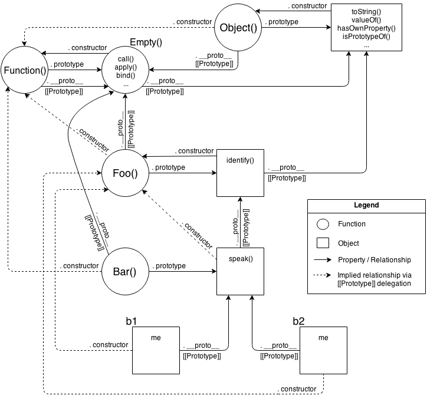
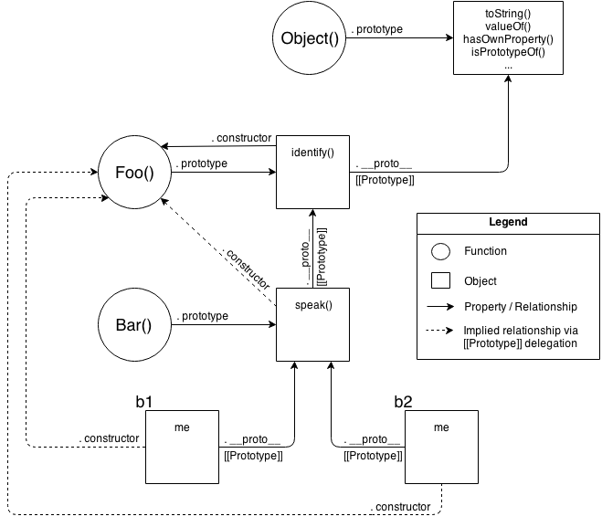
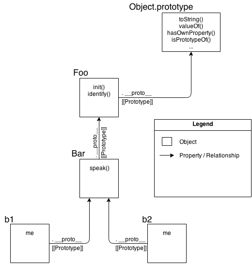

# 《你不知道的JS》笔记2——`this`和原型

注：这是《YDKJS》的第二本书《`this`和原型》的读书笔记，本次分享主要介绍原型相关内容。

## 分享内容

1. `this`
2. 传统的Class
3. JS中的`[[Prototype]]`
4. 用`[[Prototype]]`模拟Class
5. 不再模拟

## 1. `this`

上一次分享介绍了JS中的词法作用域，提到了代码（主要是函数）中的变量指向是在编译阶段确定的。不过有一个例外没有讲到，那就是函数中的`this`变量，`this`变量的指向要到运行阶段才被确定。

为什么要引入`this`变量呢？

从功能上看，`this`变量完全可以通过参数的方式把`this`所指向的值传入到函数中去。

```js
// 使用this
function speak() {
    console.log(`Hello, I'm ${this.name}.`);
}
let me = {
    name: 'Lehua'
};
speak.call(me); // => Hello, I'm Lehua.
```

```js
// 不使用this
function speak(context) {
    console.log(`Hello, I'm ${context.name}.`);
}
let me = {
    name: 'Lehua'
};
speak(me); // => Hello, I'm Lehua.
```

`this`变量提供了一个优雅和统一的方式，隐式地向函数作用域传入一个对象。（或者只是为了让Java程序员感到熟悉。）

`this`变量的指向依次按照如下的规则确定的：

1. 如果函数是通过`new`调用的，则`this`指向一个全新创建的空对象。
2. 如果函数是通过`call`、`apply`调用，或者函数进行了`bind`，则`this`指向的是显式传入的那个对象。
3. 如果函数是通过对象点方法调用的，则`this`指向点前面的对象。
4. 其他情况，`this`指向全局变量（严格模式下是`undefined`）。

```js
function f() {
    // 运行时存在一个this变量
    // 不同的调用方式this指向不同
}
let obj = {
    f: f
};
let newObj = {};

// 1.
new f();
new obj.f();

// 2.
f.call(newObj);
f.apply(newObj);
f.bind(newObj)();
obj.f.call(newObj);

// 3.
obj.f();

// 4.
f();
setTimeout(obj.f, 0);
```

在ES6中，引入了箭头函数，箭头函数本身并不存在`this`，在里面访问`this`时是根据词法作用域规则，向外层作用域一层层查找获取。

```js
let obj = {
    f: () => {
        // 根据词法作用域规则，不管f怎么被调用
        // 这里的this始终指向全局变量
    }
}

obj.f.call({});
obj.f();
setTimeout(obj.f, 0);
```

## 2. 传统的Class

面向Class是代码组织的一种方式：将数据和行为封装在一起。每个类就代表着这样一种封装的模版（蓝图），然后需要通过实例化某个类来得到该类的一个实现。

面向Class的主要特点是继承和多态。继承指一个类B从另一个类A那里继承A中的所有内容，也就是拷贝一份A中的数据和行为到B中。多态指子类可以拥有父类的同名方法。

下方代码展示了面向Class中继承的本质（即拷贝A的数据和方法到B中）：

```java
class A {
    int f1() {
        return f2();
    }
    int f2() {
        return 1;
    }
}
class B extends A {
    int f1() {
        return super.f1();
    }
    int f2() {
        return 2;
    };
}
public class Main {
    public static void main(String[] args) {
        B b = new B();
        System.out.println(b.f1()); // => 2
    }
}
```

## 3. JS中的`[[Prototype]]`

在JS中没有Class，只有对象的概念，JS中是通过原型来模拟面向Class中的继承等功能，称作“原型继承”。

JS中的原型机制大概是这样子的。JS中的每个对象，都隐含有一个`[[Prototype]]`，它会指向另外一个对象。这个`[[Prototype]]`是说，当访问某个对象的属性时，首先是从该对象本身上寻找，如果该属性不存在该对象本身，就去该对象的原型对象上找，如果还不存在，就再去该对象的原型对象的原型对象上找，直到找到或到达了原型链的顶端为止。

所以作者提到了一个更加准确的词：“代理”。一个对象代理部分行为到另一个对象。

```js
// 1.通过构造函数
function F1() {
    this.name = 'obj1';
}

function F2() {
    this.f2 = function () {
        console.log(this.name);
    }
}
F2.prototype = new F1();

function F3() {}
F3.prototype = new F2();

let obj3 = new F3();
obj3.f2(); // => obj1

// 2.通过Object.create
let obj1 = {
    name: 'obj1'
}
let obj2 = Object.create(obj1);
obj2.f2 = function () {
    console.log(this.name);
};
let obj3 = Object.create(obj2);

obj3.f2(); // => obj1

// 3.通过Object.setPrototypeOf
let obj1 = {
    name: 'obj1'
}
let obj2 = {
    f2: function () {
        console.log(this.name);
    }
}
let obj3 = {};

Object.setPrototypeOf(obj2, obj1);
Object.setPrototypeOf(obj3, obj2);
obj3.f2(); // => obj1
```

## 4. 用[[Prototype]]模拟Class

由于JS中并没有Class（抽象的蓝图），但是面向Class作为一种设计模式已经被广泛的使用了。为了模拟面向Class的编程方式，JS提出了构造函数、`new`、`instanceof`等概念。到了ES6，直接出现了`class`、`extends`等功能。然而，这些往面向Class靠的编程方式，底层依然是通过原型去模拟的。

模拟面向Class编程的第一步是模拟Class，也就是JS中的“构造函数”。有意思的是JS中其实并不真的存在“构造函数”这种类型的函数，有的只是通过前面添加`new`关键字的调用函数的方式。所以更准确来说，JS通过提供“构造函数的调用方式”来模拟Class和实例化。

```js
function C(name) {
    this.name = name;
}
C.prototype.speak = function () {
    console.log(`Hello, ${this.name}.`);
}

let a = new C('JS');
a.speak(); // => Hello, JS.
```

通过`new`的形式调用有两个效果，一个是会新生成一个对象，另一点是设置这个新对象的原型为`C`函数的`prototype`属性。这就带到了模拟的第二步，实现“继承”。上面的代码展示了新对象`a`“继承”了`speak`方法，继承的方式是通过设置`C`的`prototype`为需要继承的对象。从前面的继承定义看，这里的“继承”并不是真的继承，因为`a`并不是真正的拥有`speak`方法，拥有它的是`a`的原型对象。

这样模拟下来的效果是设置了对象`a`的原型为`C.prototype`。这跟直接通过`Object.setPrototypeOf(a, C.prototype)`没有本质区别，唯一的区别是变得更绕了。

## 5. 不再模拟

指出了JS模拟面向Class编程的问题后，作者提出为何不直接拥抱JS中的原型机制，进行“面向代理”编程呢。这种编程方式作者给它取名叫OLOO（objects linked to other objects）。

下面通过一个书中的稍微复杂点的例子，说明OLOO的好处。

首先展示面向Class（面向对象）的方式：

```js
function Foo(who) {
    this.me = who;
}
Foo.prototype.identify = function() {
    return "I am " + this.me;
};

function Bar(who) {
    Foo.call( this, who );
}
Bar.prototype = Object.create( Foo.prototype );

Bar.prototype.speak = function() {
    alert( "Hello, " + this.identify() + "." );
};

var b1 = new Bar( "b1" );
var b2 = new Bar( "b2" );

b1.speak();
b2.speak();
```

关系图：



关系图（简化版）：



下面是OLOO的方式：

```js
var Foo = {
    init: function(who) {
        this.me = who;
    },
    identify: function() {
        return "I am " + this.me;
    }
};

var Bar = Object.create( Foo );

Bar.speak = function() {
    alert( "Hello, " + this.identify() + "." );
};

var b1 = Object.create( Bar );
b1.init( "b1" );
var b2 = Object.create( Bar );
b2.init( "b2" );

b1.speak();
b2.speak();
```

关系图如下：

