1. 基本情况：

   1. 格子尺寸：10*20
   2. 方块种类：O、I、T、L、J、S、Z

2. 动作：

   1. 左右移动（Movement）：向左和向右方向键
   2. 软着陆（Soft Drop）：向下方向键
   3. 硬着陆（Hard Drop）：空格键
   4. 旋转（Rotation）：向上方向键（顺时间旋转）
   5. 暂停（Pause）：Esc

3. 超级旋转系统：

   方位：

   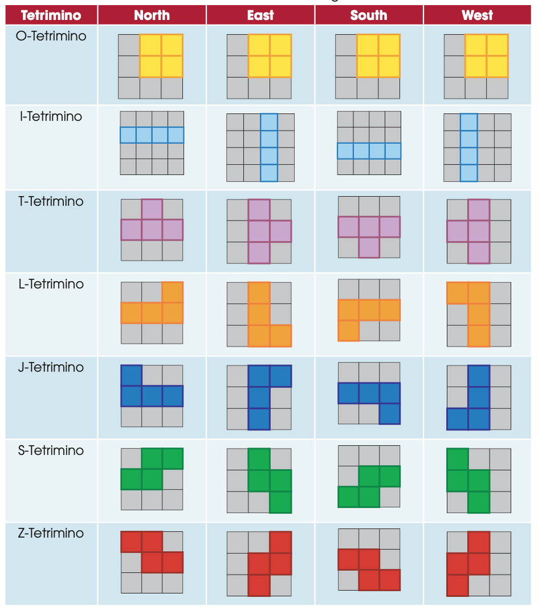

   1. 

4. 等级（15个等级，每个等级的目标为清除10行）：

   1. normal-fall-speed = (0.8 - ((level - 1) * 0.007))^ (level-1)
   2. soft-drop-speed = 20*normal-fall-speed
   3. hard-drop-speed = 0.0001
   4. lock delay = 0.50（如果是hard drop情况，则为0）
   5. generate time = 0.2

   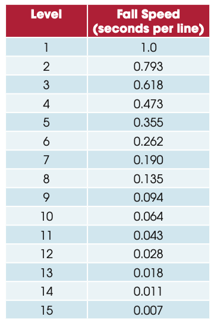

5. 记分系统（level为当前等级，n为下落格子数）：

   1. 消除单行，Single：100*level
   2. 消除双行，Double：300*level
   3. 消除三行，Triple：500*level
   4. 消除四行，Tetris：800*level
   5. 软着陆：1*n
   6. 硬着陆：2*n

### 超级旋转系统（Super Rotation System）

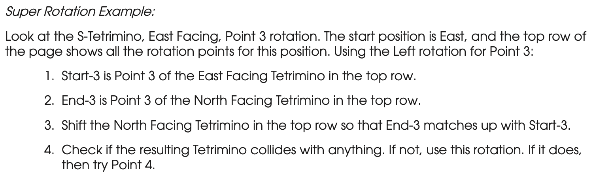

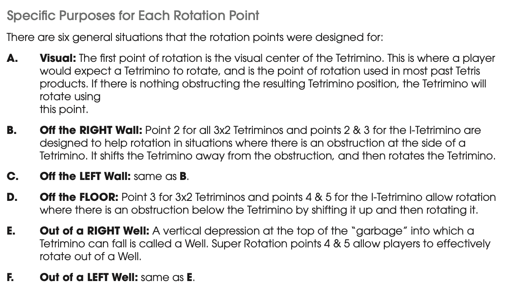

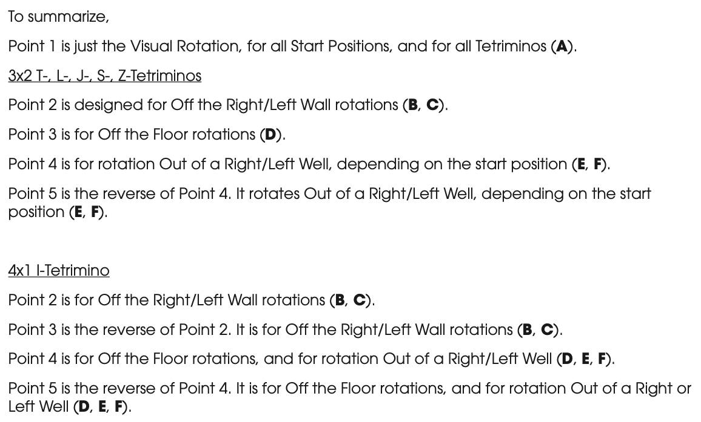

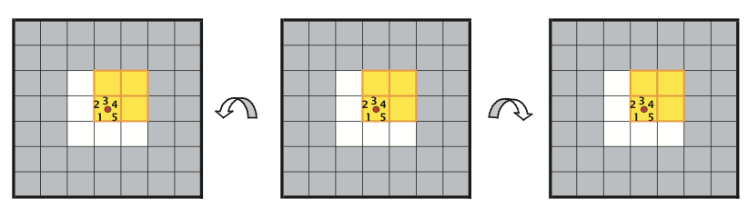

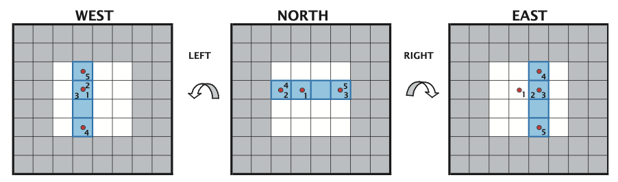

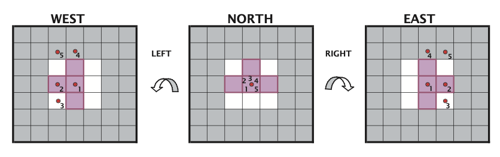

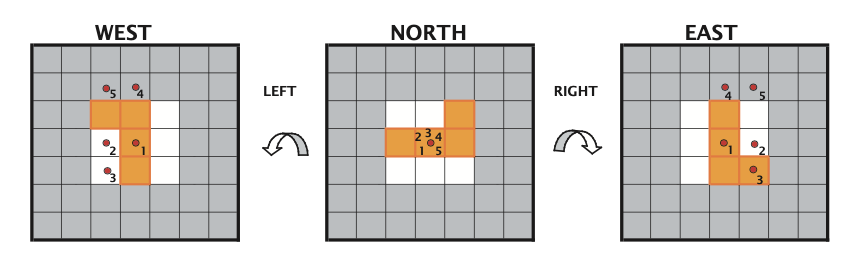

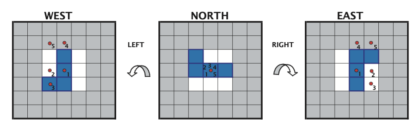

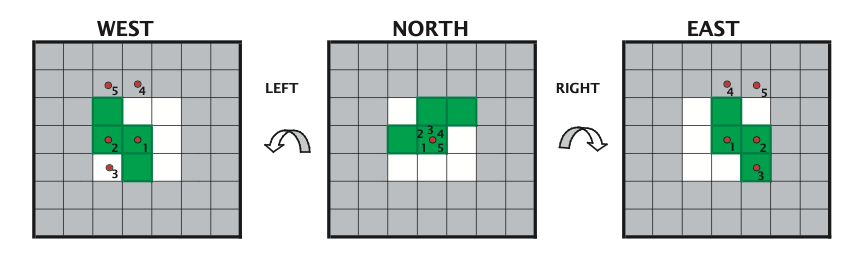

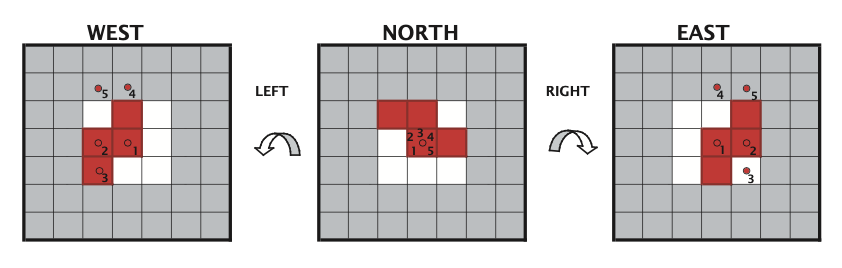

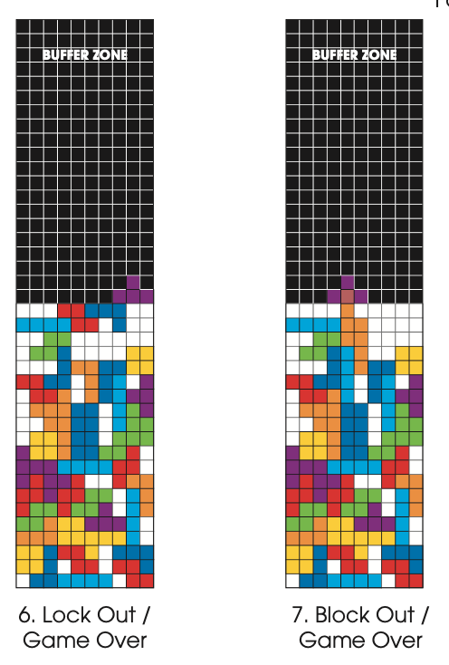