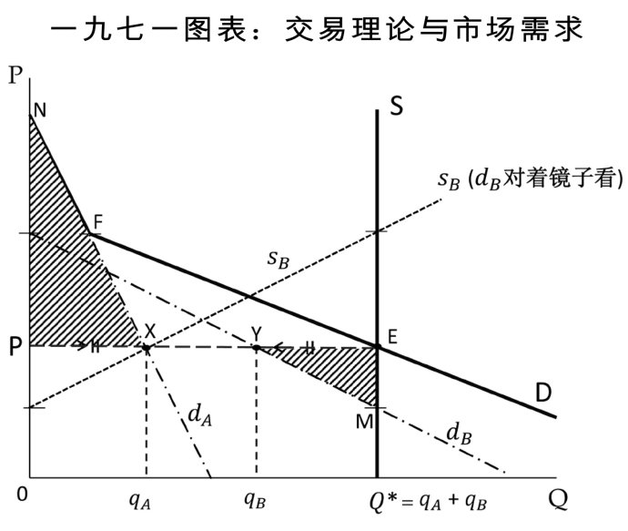

# 《经济解释》卷一《科学说需求》

## 第一章：科学的方法

对于什么是科学？什么是科学的方法？我从来没有思考过。在《经济解释》四卷本的第一卷《科学说需求》的第一章《科学的方法》中，张五常先生专门表达了他对科学和科学的方法的看法。本文是我对这一章的总结。

科学是有系统地解释现象的学问。感情的表达是艺术，理智的分析却是科学了。在追求科学的过程中，我们应该将感情和理智区分清楚，不能用主观的喜恶作为科学上的结论。

现象必有规律，不管是大自然的还是人为的。科学的形成是基于三个重要的信念。一是现象或行为的存在是主观的判断，而我们不能在这上面有所分歧；二是任何现象都一定有迹可寻；三是我们必须坚信现象的发生一定有原因。

事实不能解释事实，否则会有困难出现。在科学上，现像、事实、行为或观察所得是同一回事，解释现象往往需要非事实的抽象理论。

有些理论是没有解释能力的，比如特殊理论和套套逻辑。前一种指理论特殊到只能解释某一种现象，解释力非常小，代价很高。被推翻的理论，总可以多加条件来挽救。挽救的代价是减少理论的解释能力。科学的进步，不是因为对的理论替代了错的，而是有较为广泛解释力的，替代了较窄的；后一种指理论不可能错，连想象的错都不可能，内容是空洞的，没有解释力。但是有时对套套逻辑加上一些条件，可以促成一个有很强解释力的理论。

理论用于推测和解释现象，最重要的一点是理论的推测一定要“可能被事实推翻”。可能被事实推翻而没有被推翻，就算是被证实了。不能被事实推翻的理论没有解释能力。一个可能被事实推翻的理论，一定要可以在想象中是错的。

除了套套逻辑，还有四种情况会使一个理论免于被事实推翻的可能。一是概念或分析模糊不清，不可能清楚地错，所以不可能清楚地被事实推翻；二是相互矛盾的理论；三是理论的推测不能被观察到；四是理论推测会发生的现象没有限制。

因为事实不能以事实解释，以理论解释现象，在某种程度上一定是抽象的。理论有四种非真实，前三种可以接受。一是理论本身必定有抽象的成分，因为事实不能解释事实；二是事实或观察的描述必须经过简化，减少对无关属性的描述；三是为便于处理而作简化，减少无关现象所带来的复杂；四是验证条件的假设，虽为假设，却不能脱离现实。

推测与解释是同一回事，但有事前与事后之分。

读完该章，我决定在以后的讨论和分析中，对感性和理性一定要加以判断区分。如果是讨论一些主观上的东西，大可不必浪费时间去争论，此时最需要的是尊重他人的喜恶。但是，如果是讨论一些客观的，科学的东西，我应该秉着科学的态度，减小感情方面的因素所带来的影响。比如跟我讨论的那个人我不喜欢或嫉妒，又或者为了面子而坚持自己的想法肯定正确，别人的想法肯定错误。

在解释某个理论或思想时，使用一些贴切的例子可以达到事半功倍的效果。这是我以后写文章需要加强的地方。

## 第二章：从自私说起

在这一章，张老指出了经济学最重要的几个基础假设。

一，“个人”是所有经济分析的基本单位。这是因为所有取舍或选择都是由个人做主的。“人会做选择”。经济学的第一个公理是任何人的行为，都是由个人作出可以被推测的选择而起。

二，每个人的任何行为，都是自私自利的。重要的不是人究竟是怎样，而是我们要假设人是怎样。然后以这个假设为出发点去推测事实。任何的行为都需要使用自私自利这个假设来解释，但解释时需要加入一些局限条件，否则就成了没有内容的套套逻辑。

人的自私本质，来源于斯密的自然淘汰观。斯密指出了自私可以给社会整体带来巨大的利益，但却轻视了自私也会给社会带来害处。这是张老的重点。

假若人的本质是自私的不能更改，那么一个基于人的自私可以被更改的“主义”，其制度政策会失败。

说过了，这里说的“自私”是“局限下争取个人利益极大化”的简称，是个假设，毫无价值观，是好是坏无关宏旨也。

## 第三章：缺乏与竞争

在这一章中，张老讲了经济学中的两个不可或缺的概念：缺乏与竞争。

以理论来解释行为，行为一定要受到理论的约束。

凡是有胜于无的东西，不管有形或无形，都是物品。物品又可以分为两大类：其一是经济物品；其二是免费物品。在有胜于无之中，有一大部分是多胜于少的，其为经济物品。

“多胜于少”是经济物品的定义，也是“缺乏”的定义。“缺乏”是因为在需求下，供应有限而引起的。凡是有人愿意付出或多或少的代价来争取多一点的物品，都是缺乏的、不足够的，那就是经济物品了。

竞争的定义，是指一种经济物品的需求有多于一人的需求。因为缺乏而引起的竞争，跟任何运动一样，是要有游戏规则的。产权制度是竞争的游戏规则，也就是约束行为的一种局限条件。阿尔钦说得好，“产”、竞争、缺乏这三个词是同义的。

在自由市场，价高者得，市价于是成为决定胜负的准则。促成这市价的游戏规则，是私有产权的制度。

张老认为准则在先而游戏规则在后。因为决定胜负的准则所决定的，是人类以竞争来解决的问题，而游戏规则只不过是协助准则的成立而已。

因为竞争准则对人的收入、享受有决定性的作用，所以在不同的准则下，人的行为会跟着不同。

一般书本说的、比较容易明白但不大正确的浪费概念：一般而言，浪费是指有其他办法，或用其他资源使用的分配，可使社会的财富或收入增加，但这些“其他”办法却莫名其妙地不予采用。

唯一没有浪费的竞争准则，是市价。

在不同的竞争准则下，胜或负的人各各不同。一些人喜欢选择某一种准则，另一些人会选择另一种。这些行为属于经济学的范畴。但哪一种准则是好是坏，或对社会福利有何好处，则是伦理或价值观的事。

经济学不能判断什么是好是坏。经济学的范畴包括三部分。

第一，在知道有关的局限条件或游戏规则（即产权制度或人与人之间的权利划分）的情况下，推断所用的竞争准则是什么。

第二，在有了竞争的准则的情况下，推断人的行为会怎样，资源的使用会怎样，财富或收入的分配会怎样。

第三，解释游戏规则是怎样形成的。

## 第四章：功用的理念

在这一章中，张老反对功用理论。其主要原因是，“功用”只不过是经济学者想象出来的概念，不是事实，所以要推断出可以被事实验证的含意不仅困难，而且陷阱太多，以致推出来的很容易是套套逻辑。

“功用”是武断地以数字排列选择的定名。引入“功用”只是为了给各种选择一个名称，方便描述选择。

替换定理：每一个人都愿意牺牲任何物品来换取任何其他的物品，只要牺牲的够少，而换得的够多。

“等优曲线”就是根据替换定理推出的，关于两种经济物品在这些点上的功用数字相同的曲线。（不明白以甲乙的什么为横纵轴。功用？）

再增加行为约束，则等优曲线一定是内凸（向左下弯曲）的。因为假设功用数字不变（在同一等优曲线上），一个人拥有甲物品愈多，其意愿以乙物品替换甲物品的意图必定下降。

收入增加而需求量减少的物品，称为贫穷物品。某物品的价格下降带来的实质收入增加，导致该物品的需求量下降，称为吉芬物品。吉芬物品只能在一人世界存在，不可能在有竞争的社会存在。

对于不能在市场成交或无从以金钱度量的经济物品，可以用其代价做替换，从而完全抛弃功用理论。

## 第五章：需求定律

在这一章中，张老讲解了需求定理的定义和应用。

需求定律是说任何物品的价格下降，其需求量必定上升。

前一章的功用分析推不出一条一定向右下倾斜的需求曲线，无法推出需求定律。对于没有市价的物品，我们可以用代价或牺牲替换，需求定律依然可用。

需求量是指需求者的意图之量，在真实世界不存在。因此，我们必须加上其他的验证条件（可以观察到的局限条件的转变），才可以用需求定律推出可以被事实验证的假说。

关于观察，有三类。第一类是无从观察的，实际上不存在，比如需求量。第二类是可以观察到的真有其物，比如价格。第三类是原则上可以观察到，但实际上观察很困难，我们要想办法找寻间接的替代来作验证，比如边际产量。

解释行为需要以事实验证假说，真实世界不存在的变量或术语愈少愈好。说故事与科学解释是两回事。

以一种物品来说，除了这物品的价格与需求量这两个变量之外，可以影响该物品的需求量的其他变量或因素数之不尽。其他可变但假设不变的量称为参数。要维护需求定律的解释里，哪些量可变哪些量不可变是大话题。

需求定律约束着价格或代价（一个变量）与需求量（另一个变量）之间的关系。然而，可以影响需求量的因素多如天上星，价格只是其中之一罢了。

其他不变量的选择准则：只要需求定律的验证含意不被事实推翻，其他的不变因素愈少愈好——其他可变量愈多愈好——因为这会增加需求定律的解释现象的广泛性。

在该准则下，如下的三项“不变”与“变”的界定是“安全”的——安全者，不被事实推翻也。

（一）凡是直接影响价格的其他因素皆可变。
（二）凡是直接影响需求量的其他因素皆不可变。
（三）价格转变会导致需求量的转变，这价格转变也可能导致其他因素的转变，而这些“其他因素”可能再影响需求量。这些在“中间”的、间接地影响需求量的因素（变量）皆可变。

要以需求定律解释行为，应该假设每个人的品味不变。以品味解释行为的困难是我们不是上帝，不能判断一个人的品味是怎样的，也不能判断这个人的品味是否改变了。即使我们知道品味是什么，如何变化。但是这时我们仍然需要知道品味转变的原因，但如果知道成因，我们根本无须提及品味的转变。

斯密指出价值有两种，其一是用值，其二是换值。顾名思义，用值是某物品给予拥有者或享有者的最高所值，或这个人愿意付出的最高代价。换值是获取该物品时所需要付出的代价，而在市场上，换值就是该物品的市价了。

何为价？价是一个消费者对某物品在边际上所愿意付出的最高代价。

某物品的边际用值比市价高，消费者会多够一点；若比市价低，这消费者当然不会购买。这是个人争取最大利益的假设使然。

何为量？成交量和需求量是两回事。成交量是事实，是可以观察到的。需求量不是事实，无从观察，是个概念，没有经济学者“需求量”是不存在的。

概念上，需求量是指在不同的价格（换值）下，消费者意图换取的最高的量。需求曲线于是成为在不同价格下最高的不同需求量的界线。

量，可分为“有质”的与“委托”的两大类，也有两者的合并。凡是质量被直接度量而算价的，是有质的量。相反则为委托的量。

需求定律永远用于价格及其直接联系着的量之间的关系。（说白了就是价格体现在物品的什么上，是物品的重量，还是物品的数量）

用值与换值的差额就是消费者的盈余。因为顾客的需求曲线各个不同，多些不同的收费安排，榨取消费者盈余可以“榨”得“尽”一点。

价格下降，购买者对该物品的消费总额可能下降也可能上升。从出售者那边看，减价后的收入可能下降也可能上升。其决定关键是需求的价格弹性。要记着，价格弹性系数是从一个价位来算的。一条需求曲线有数之不尽的价位，价格弹性系数可以价价不同：曲线上某部分的弹性系数大于一，某部分小于一。

阿尔钦与施蒂格勒提出需求第二定律：弹性系数的大小与时间是正相关的。他们认为，找寻替代物品来替换是需要时间的。时间愈长，替换的机会愈大，所以该物品的价格弹性系数是与时间正相关的。张老的反驳是，替换物品有时众所周知，不需要找寻。这样，价格上升，消费者立刻转用已知的替代物品，但用了一段时期，认为不称意，就转回旧物那方面去了。

## 第六章：小试牛刀

张老在这一章中展示了需求定律的预测能力。由需求定律推出来的事实可以向物理学或化学那样精确。

差不多任何物品，要准确地判断其质量不容易。我们往往要花很大的功夫才能成为一样物品的衡量专家。所以一般来说，无知，加上自己以往的经验，同类之物，我们往往见到价格较高就会认为质量较好。这样的判断不一定对，但对的机会不会差。我们会认为市价较高质量应该较好，因为市场已作了鉴别。以价判质过程真实且重要。（这里的分析如下，如果有一个两克拉的钻石卖1000块，我们一般会觉得是假的，也就是说钻石的质量很低，自然我们就不愿意付1000块钱交换。）

其他因素、验证条件与局限条件这三者有相同之处，但在角度上有重要的差别。下面以需求定律来解释。

一条向右下倾斜的需求曲线约束某物品的价与量的关系，二者皆是变量。“其他因素”是指这两个变量之外的所有其他变量，有些我们让其变，有些不让其变。

以需求定律而言，验证条件是其他因素中的一小部分，是那些为了要创造一个可以被事实验证的含意而指定的条件。如果在你面前有两个不同的假说，你可以想啊想，想出一个或几个验证条件。指定了之后，在逻辑上，事实或现象只可以支持两个假说的其中一个。这就是关键验证。

“局限条件”是指约束行为的所有条件。以需求定律而言，局限条件不仅包括其他的有关因素，包括验证条件，也包括价格。

整个经济学的原理或定理其实不多。问题是运用起来，以这些原理解释世事，其困难程度会大幅上升。大致上，困难有三方面的。

（一）世界的局限条件——约束每个人争取最大利益的局限——非常复杂。
（二）验证含意——甲的发生会导致乙的发生——这里的甲与乙，又或加上丙、丁等的有关变量，必须可以在真实世界中观察到。需求定律中的需求量是一个意图的变量，并非事实。那就是说，需求定律的本身是不可以验证的。我们要以需求定律，加上局限条件的变化，从逻辑推出可以被事实验证的含意。这里验证条件的指定要讲功夫了。
（三）其他因素的变与不变的选择。

需求定律是经济学的灵魂，而这灵魂的重点是要懂得怎样处理需求量这个抽象概念。以需求定律解释行为，我们要不是能以逻辑把需求量与成交量挂钩，就是不管成交量，单以需求量转变的含意来解释现象。

“单质”是指一种物品只有一种质量，于是质多量多，质少量少，质与量相同。

单质的需求验证。影印行为的示范：从加薪转到研究金的局限转变（验证条件），需求定律可以推出影印的数量会上升。解释：由于研究金能使用的范围小，所以研究金的一毫比加薪的一毫所值要少，比如是六仙。那么由需求定律，价格下降，需求量上升。而需求量表现为影印数量。

多质的需求验证。例子：美国华盛顿州的顶级苹果（红苹果）大都卖出口（比如卖到香港），而本地人多吃次级苹果。解释：因为有了固定的运费，糖分及其他质量上升时（从次级变为顶级），这些质的间接之价在香港跌得很快。对于香港的消费者，不管是次级还是顶级苹果，都需要在糖分的费用上加上一个固定的运费，从而次级苹果的价格相对来说更贵。

## 第七章：交易理论与市场需求

张老在这一章，讲解了交易理论（主要是没有交易生产的交易）和市场需求（是个人需求之和，有两种换算方式）。

要决解人与人之间的竞争，我们的社会发明了制度。制度有多种，市场是其中之一。

交易是上下交征利（相互之间都得到利益），与没有交易相比，个人的利益增加大得惊人。但这庞大的利益增加，主要是由于每个人专业生产，然后交易。不谈生产而单论交易，利益还是有的，但比起有专业生产的存在，其交易的利益少很多，近于微不足道。

没有专业生产的交易，大家有利可图，主要是因为大家对物品的边际用值不同。当边际用值与市值（换值）相等时，就达到了市场均衡，也达到了帕累托条件（帕累托说：资源的使用与物品的交易可以达到一个情况或条件，满足了这个条件，我们不可能改变资源的使用，使一个人得益而没有其他人受损。换言之，要是这个条件不达到，我们总可以改变资源的使用或市场的交易，而使社会起码有一个人得益而没有其他人受损——这也等于可使整个社会的人得益）。

市场需求是所有个人需求加起来而成的。私用品（一个人享用其他的人就不能享用）的市场需求曲线是个别需求者的不同需求曲线向右横加（P为每价，Q为该价的所有需求者的需求量之和）而成的。

每个需求的人都以市价与自己的边际用值相比，然后购进或沽出。每个人都这样做，其结果是每个人的边际用值皆与市价相等，而人与人之间对这物品的边际用值也因而相等。

物品的市场需求曲线与市场供应曲线的相交之价，是市价，又称均衡市价，而每个需求者的边际用值与之看齐。相交之价，不是因为马歇尔所说的剪刀决定的。而是因为数之不尽的需求者与供应者，各自争取最高的交易利益，导致均衡市价出现。

对于市价的厘定，不是像一些经济学者认为的是因为市场需求曲线与市场供应曲线相交。正相反，这市场二线相交，是因为数之不尽的需求者与供应者各自为战，争取自己的边际用值与市价相等，从而促成了市场二线相交。

短缺与过剩皆空中楼阁，不是真实世界之物。

经济学者发明的稳定的均衡与不稳定的均衡，是为了故扮高深，与世事无关。可以用简单的分析来处理复杂的均衡问题。价格若高于或低于市价，市场需求者的边际用值会低于或高于价格。他们为了增加私利，会沽出使价格下降，或购入使价格上升。市价于是因为人的自私而升降，也因为人的自私而安定下来。所以说，需求定律是包含着“个人争取利益极大化”这个假设或公理。

价格管制是价格被管制在市价之下，需求的一方见自己的边际用值高于价格，竞争抢购不获，逼着要付出金钱价格之外的其他代价来作补充而争取。这些其他的补充准则可能是排队轮购，可能是论资排辈、武力解决、政治手法、人际关系等等。于是会有另一种均衡，不会有“短缺”，而竞争就会被解决了。“短缺”是因为经济学者的思想有所短缺而产生的。

价格管制的分析困难，不是因为不均衡，而是我们不知道哪一种金钱之外的准则会被采用。

市场这种制度的出现，是为了减少某些交易或社会费用，这些减少了的费用是些什么，是一个大难题。

## 第八章：共用品的经济分析

张老在这一章阐述了自己对共用品的认识。

共用品的性质是共用，多人可以共享而不干扰他人的享用，多供应一个人的边际费用或成本为零。差不多所有的物品都具有共用品与私用品的性质。市场喜欢以私用品的量作价，因为私用品比较容易隔离不付费的享用者。这里注意区分私用和私有，以及共用和公有，他们是完全不同的概念。

我们对同一个物品的边际用值不同，为了达到帕累托条件，商家需要实行价格分歧，但是价格分歧的费用奇高，因为商家不容易知道我们各自的边际用值。

私用品的市场需求曲线是每价加量，即向右横加。共用品的市场需求曲线是每量加价，即向上竖加。

萨缪尔森认为，共用品多供应一个人的边际费用或成本为零，所以共用品不应该收费。但是张老分析认为，如果边际成本为零不应该收费，那么近于零的也不应该收费。进而分析如果收费低于平均成本或费用，私营一定亏本，而如果收费等于或高于平均成本，那么收费会在边际成本之上（因为平均成本因为产量增加而下降）。所以，收费高于边际成本，对社会有害无益，从而得出不收费或由政府资助而又管制价格的上策。这是一种价值观，老生常谈了。

牵扯到收费问题，共用品有互相矛盾的两种看法。其一是要采用价格分歧，收到尽，才可以达到帕累托条件。其二是多供应一个享用者的边际费用或成本是零，应该一律不收费。是有趣的价值观，不可以解释市场现象，却可以解释某些政客及经济学者的行为。

张老举钢琴演奏家的例子来反驳萨缪尔森的观点。因为共用品可以私营产出，再把共用品捆绑着私用品一起销售，可以隔离不付费的人，减少交易费用。

共用品大家可以一起享用，但也有挤迫情况，大家不是完全没有干扰。这里的要点是：无论怎么挤迫，只要共用品的量不变，不会因为挤迫而变为私用品。挤迫会导致个别享用者的需求曲线上、下移动，不会左、右移动。产出共用品的人要考虑的是市场的需求，不是个别人士的需求。

## 第九章：经济学的理论结构与哲学性质

张老在这一章讲了经济学的理论结构（通过一张图表），以及对经济学的哲学性质的思考。

交易理论与市场需求图：

注：附图以纵轴为价（P），横轴为量（Q）。竖直的S线代表着某物品的供应总量（Q\*），假设固定不变。有A与B两个人，dA与dB分别是二者对该物品的需求曲线。先假设在交易之前该物品全部为B所有。这样，该物品给B的边际用值是M。A完全没有该物品，其边际用值是N。在这情况下，如果交易之价高于M，B会出售给A。另一方面，如果购买之价低于N，A会购入。均衡点是B的边际用值与A的边际用值相等。从图表可见，B出售到Y点，他的边际用值会跟A购入到X点的边际用值相等，而B的售出量（EY）一定与A的购入量（PX）相等。P是他俩的成交价，也即是市价。A获得的总用值是面积ONXqA，付出的总换值是面积OPXqA，所以面积NXP是A的交易总利。B放弃的总用值是面积YMQ\*qB，获得的总换值是面积YEQ\*qB（即OPXqA），所以面积YEM成为B出售给A所获的总利。把A的需求曲线dA与B的需求曲线dB每价向右横加而得到A与B合共的需求曲线，也就是市场的需求曲线了。B的需求曲线（dB）对着镜子就成了B的供应或售出曲线，即sB。sB在X那点与A的需求曲线（dA）相交，代表着B的边际成本与A的边际用值相等，是从另一个角度看市场均衡。

张老认为的经济学的哲学性质：作为一门以武断假设或公理为起点的科学，除了边际产量下降定律，这些公理不是基于一些可以观察到的或真有其物的生理细胞或基因的运作，而是基于自然淘汰，是从人类的行为引申回头而获得的定义或规律。不同公理或武断假设之间没有矛盾，推得出可以用事实验证的假说，就成为一门实证科学了。因为经济学的公理的非真实性比自然科学的来得普及，科学的方法逻辑就比其他自然科学有较大的监管用场了。

同样是公理性的科学，自然淘汰的思维，用于自然科学要从公理含意着的微小现象的变化入手，单用于经济学则要倒转过来，以人类行为的规律细节把公理或定义作修改或补充，是对还是错，最终的衡量是问这些公理约束着的人类的行为能否经得起自然淘汰的蹂躏。